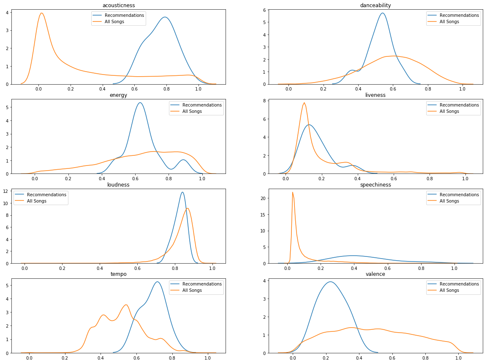

```python
import json
import pandas as pd
from pprint import pprint
import os
import numpy as np
import matplotlib.pyplot as plt
import sys
import keras
import spotipy
import spotipy.oauth2
import seaborn as sns

from sklearn.model_selection import train_test_split
from scipy.sparse.linalg import svds
from sklearn.neighbors import NearestNeighbors
from sklearn.metrics.pairwise import linear_kernel
from sklearn import preprocessing
from scipy.sparse import coo_matrix

fileDir = os.path.dirname(os.path.realpath('__file__'))
```


    Using TensorFlow backend.


    ---------------------------------------------------------------------------

    RuntimeError                              Traceback (most recent call last)

    RuntimeError: module compiled against API version 0xc but this version of numpy is 0xb


    ---------------------------------------------------------------------------

    ImportError                               Traceback (most recent call last)

    ImportError: numpy.core.multiarray failed to import


    ---------------------------------------------------------------------------

    ImportError                               Traceback (most recent call last)

    ImportError: numpy.core.umath failed to import


    ---------------------------------------------------------------------------

    ImportError                               Traceback (most recent call last)

    ImportError: numpy.core.umath failed to import


**Major To-Dos**:
- Need genres for validation
- Need lyrics for additional models
- Audio data would be a nice to have for additional models
- Other to-dos for generalizing methods / improving usability of code included below
- Try building factorization machine model
- Comparison of error on various models tried below
- **Replace track frame with URI frame given non-unique names**

**Section 1. The below loads in the datasets. The explode and unpack functions are used to generate a matrix with a line for each song play, with a playlist ID to indicate which playlist it originally came from.**


```python
n_playlists = 1999
playlists_list = list()
lower_bound = 0
upper_bound = 999
step = 1000

while (upper_bound <= n_playlists):
    slice_name = 'data\mpd.slice.' + str(lower_bound) + '-' + str(upper_bound) + '.json'
    test_string = os.path.join(fileDir, slice_name)
    with open(test_string) as json_data:
        d = json.load(json_data)
        json_data.close()
        playlists_list.append(d['playlists'])
    lower_bound += step
    upper_bound += step
    
flatten = lambda l: [item for sublist in l for item in sublist]
playlists_list = flatten(playlists_list)
```


```python
def explode(df, lst_cols, fill_value=''):
    if lst_cols and not isinstance(lst_cols, list):
        lst_cols = [lst_cols]
    idx_cols = df.columns.difference(lst_cols)

    lens = df[lst_cols[0]].str.len()

    if (lens > 0).all():
        return pd.DataFrame({
            col:np.repeat(df[col].values, lens)
            for col in idx_cols
        }).assign(**{col:np.concatenate(df[col].values) for col in lst_cols}) \
          .loc[:, df.columns]
    else:
        return pd.DataFrame({
            col:np.repeat(df[col].values, lens)
            for col in idx_cols
        }).assign(**{col:np.concatenate(df[col].values) for col in lst_cols}) \
          .append(df.loc[lens==0, idx_cols]).fillna(fill_value) \
          .loc[:, df.columns]
    
def unpack(df, column, fillna=None):
    ret = None
    if fillna is None:
        ret = pd.concat([df, pd.DataFrame((d for idx, d in df[column].iteritems()))], axis=1)
        del ret[column]
    else:
        ret = pd.concat([df, pd.DataFrame((d for idx, d in df[column].iteritems())).fillna(fillna)], axis=1)
        del ret[column]
    return ret
```


```python
temp_frame = pd.DataFrame(playlists_list)
temp_frame.tracks[0]

lst_col = 'tracks'
exploded_frame = explode(temp_frame, ['tracks'], fill_value='')
playlists_frame = unpack(exploded_frame,'tracks','')
playlists_frame.head()
```


<div>
<style scoped>
    .dataframe tbody tr th:only-of-type {
        vertical-align: middle;
    }

    .dataframe tbody tr th {
        vertical-align: top;
    }

    .dataframe thead th {
        text-align: right;
    }
</style>
<table border="1" class="dataframe">
  <thead>
    <tr style="text-align: right;">
      <th></th>
      <th>collaborative</th>
      <th>description</th>
      <th>duration_ms</th>
      <th>modified_at</th>
      <th>name</th>
      <th>num_albums</th>
      <th>num_artists</th>
      <th>num_edits</th>
      <th>num_followers</th>
      <th>num_tracks</th>
      <th>pid</th>
      <th>album_name</th>
      <th>album_uri</th>
      <th>artist_name</th>
      <th>artist_uri</th>
      <th>duration_ms</th>
      <th>pos</th>
      <th>track_name</th>
      <th>track_uri</th>
    </tr>
  </thead>
  <tbody>
    <tr>
      <th>0</th>
      <td>false</td>
      <td>NaN</td>
      <td>11532414</td>
      <td>1493424000</td>
      <td>Throwbacks</td>
      <td>47</td>
      <td>37</td>
      <td>6</td>
      <td>1</td>
      <td>52</td>
      <td>0</td>
      <td>The Cookbook</td>
      <td>spotify:album:6vV5UrXcfyQD1wu4Qo2I9K</td>
      <td>Missy Elliott</td>
      <td>spotify:artist:2wIVse2owClT7go1WT98tk</td>
      <td>226863</td>
      <td>0</td>
      <td>Lose Control (feat. Ciara &amp; Fat Man Scoop)</td>
      <td>spotify:track:0UaMYEvWZi0ZqiDOoHU3YI</td>
    </tr>
    <tr>
      <th>1</th>
      <td>false</td>
      <td>NaN</td>
      <td>11532414</td>
      <td>1493424000</td>
      <td>Throwbacks</td>
      <td>47</td>
      <td>37</td>
      <td>6</td>
      <td>1</td>
      <td>52</td>
      <td>0</td>
      <td>In The Zone</td>
      <td>spotify:album:0z7pVBGOD7HCIB7S8eLkLI</td>
      <td>Britney Spears</td>
      <td>spotify:artist:26dSoYclwsYLMAKD3tpOr4</td>
      <td>198800</td>
      <td>1</td>
      <td>Toxic</td>
      <td>spotify:track:6I9VzXrHxO9rA9A5euc8Ak</td>
    </tr>
    <tr>
      <th>2</th>
      <td>false</td>
      <td>NaN</td>
      <td>11532414</td>
      <td>1493424000</td>
      <td>Throwbacks</td>
      <td>47</td>
      <td>37</td>
      <td>6</td>
      <td>1</td>
      <td>52</td>
      <td>0</td>
      <td>Dangerously In Love (Alben für die Ewigkeit)</td>
      <td>spotify:album:25hVFAxTlDvXbx2X2QkUkE</td>
      <td>Beyoncé</td>
      <td>spotify:artist:6vWDO969PvNqNYHIOW5v0m</td>
      <td>235933</td>
      <td>2</td>
      <td>Crazy In Love</td>
      <td>spotify:track:0WqIKmW4BTrj3eJFmnCKMv</td>
    </tr>
    <tr>
      <th>3</th>
      <td>false</td>
      <td>NaN</td>
      <td>11532414</td>
      <td>1493424000</td>
      <td>Throwbacks</td>
      <td>47</td>
      <td>37</td>
      <td>6</td>
      <td>1</td>
      <td>52</td>
      <td>0</td>
      <td>Justified</td>
      <td>spotify:album:6QPkyl04rXwTGlGlcYaRoW</td>
      <td>Justin Timberlake</td>
      <td>spotify:artist:31TPClRtHm23RisEBtV3X7</td>
      <td>267266</td>
      <td>3</td>
      <td>Rock Your Body</td>
      <td>spotify:track:1AWQoqb9bSvzTjaLralEkT</td>
    </tr>
    <tr>
      <th>4</th>
      <td>false</td>
      <td>NaN</td>
      <td>11532414</td>
      <td>1493424000</td>
      <td>Throwbacks</td>
      <td>47</td>
      <td>37</td>
      <td>6</td>
      <td>1</td>
      <td>52</td>
      <td>0</td>
      <td>Hot Shot</td>
      <td>spotify:album:6NmFmPX56pcLBOFMhIiKvF</td>
      <td>Shaggy</td>
      <td>spotify:artist:5EvFsr3kj42KNv97ZEnqij</td>
      <td>227600</td>
      <td>4</td>
      <td>It Wasn't Me</td>
      <td>spotify:track:1lzr43nnXAijIGYnCT8M8H</td>
    </tr>
  </tbody>
</table>
</div>


**Section 2. The cell below generates a matrix of P playlists x N songs (tracks_frame), with a 1 whenever a song is present in a playlist. This is the starting format to use for a number of the recommendation system techniques.**


```python
# Create necessary starting matrix dimensions for matrix factorization
# To do: update all references to be based on track ID rather than track name
playlists_frame.drop_duplicates(['track_name','pid'],keep= 'last',inplace=True)
tracks_frame = playlists_frame.pivot_table(values = 'pos',index = 'pid', 
                                           columns ='track_name',aggfunc=lambda x:len(x.unique())).fillna(0)
```


```python
unique_tracks = playlists_frame.drop_duplicates(subset='track_uri')
```


**Section 3. The cells below perform matrix factorization and test it. Matrix factorization attempts to find the "k" dimensional matrix that best approximates user's actual preferences. There is no interpretability of the resulting values, but it has strong predictive power.**


```python
# Matrix factorization operations: ref https://beckernick.github.io/matrix-factorization-recommender/
U, sigma, Vt = svds(tracks_frame, k = 50)
sigma = np.diag(sigma)
first_product = np.dot(U,sigma)
all_predicted = np.dot(first_product,Vt)
pred_df = pd.DataFrame(all_predicted,columns=tracks_frame.columns)
pred_df.head()
```


<div>
<style scoped>
    .dataframe tbody tr th:only-of-type {
        vertical-align: middle;
    }

    .dataframe tbody tr th {
        vertical-align: top;
    }

    .dataframe thead th {
        text-align: right;
    }
</style>
<table border="1" class="dataframe">
  <thead>
    <tr style="text-align: right;">
      <th>track_name</th>
      <th>"*!*!" What U Heard</th>
      <th>"40" - Remastered 2008</th>
      <th>"45"</th>
      <th>"A Lovely Night"</th>
      <th>"A Lovely Night" (Reprise)</th>
      <th>"C" Is For Cookie - Introduction</th>
      <th>"Can't Repeat The Past?"</th>
      <th>"Do I Love You Because You're Beautiful"</th>
      <th>"Esh 'Dani, Alash Mshit"</th>
      <th>"Gatsby Believed In The Green Light"</th>
      <th>...</th>
      <th>양화대교 (Yanghwa Brdg)</th>
      <th>오늘 헤어졌어요</th>
      <th>왜 (Keep Your Head Down) [Rearranged]</th>
      <th>왜 이러니</th>
      <th>우주보다 좋아해 (I Love You More Than Universe)</th>
      <th>으르렁 Growl</th>
      <th>전야 前夜 The Eve</th>
      <th>주문 Mirotic</th>
      <th>중독 Overdose</th>
      <th>헤어지지 못하는 여자, 떠나가지 못하는 남자 Can't Breakup Girl, Can't Breakaway Boy (feat. 정인 Jung In)</th>
    </tr>
  </thead>
  <tbody>
    <tr>
      <th>0</th>
      <td>-0.001311</td>
      <td>0.000029</td>
      <td>0.000731</td>
      <td>-0.000045</td>
      <td>-0.000045</td>
      <td>-0.001146</td>
      <td>-0.000216</td>
      <td>-0.000045</td>
      <td>-4.344472e-19</td>
      <td>-0.000216</td>
      <td>...</td>
      <td>-0.000304</td>
      <td>0.000183</td>
      <td>0.000183</td>
      <td>0.000183</td>
      <td>0.000183</td>
      <td>-0.000802</td>
      <td>-0.000161</td>
      <td>0.000183</td>
      <td>-0.000538</td>
      <td>0.000183</td>
    </tr>
    <tr>
      <th>1</th>
      <td>-0.000545</td>
      <td>0.000004</td>
      <td>-0.000293</td>
      <td>0.006850</td>
      <td>0.006850</td>
      <td>0.000055</td>
      <td>-0.000051</td>
      <td>0.006850</td>
      <td>-3.026727e-19</td>
      <td>-0.000051</td>
      <td>...</td>
      <td>-0.000039</td>
      <td>-0.000043</td>
      <td>-0.000043</td>
      <td>-0.000043</td>
      <td>-0.000043</td>
      <td>-0.000072</td>
      <td>0.000007</td>
      <td>-0.000043</td>
      <td>-0.000034</td>
      <td>-0.000043</td>
    </tr>
    <tr>
      <th>2</th>
      <td>0.001203</td>
      <td>0.000025</td>
      <td>0.000073</td>
      <td>0.000101</td>
      <td>0.000101</td>
      <td>0.000299</td>
      <td>0.000032</td>
      <td>0.000101</td>
      <td>-1.574184e-19</td>
      <td>0.000032</td>
      <td>...</td>
      <td>0.000259</td>
      <td>0.000055</td>
      <td>0.000055</td>
      <td>0.000055</td>
      <td>0.000055</td>
      <td>0.000251</td>
      <td>0.000219</td>
      <td>0.000055</td>
      <td>0.000539</td>
      <td>0.000055</td>
    </tr>
    <tr>
      <th>3</th>
      <td>0.000810</td>
      <td>-0.000027</td>
      <td>0.000374</td>
      <td>-0.000289</td>
      <td>-0.000289</td>
      <td>0.000387</td>
      <td>0.000028</td>
      <td>-0.000289</td>
      <td>-2.790878e-19</td>
      <td>0.000028</td>
      <td>...</td>
      <td>0.000248</td>
      <td>0.000047</td>
      <td>0.000047</td>
      <td>0.000047</td>
      <td>0.000047</td>
      <td>0.000171</td>
      <td>0.000150</td>
      <td>0.000047</td>
      <td>0.000374</td>
      <td>0.000047</td>
    </tr>
    <tr>
      <th>4</th>
      <td>-0.000439</td>
      <td>0.000017</td>
      <td>-0.000350</td>
      <td>0.000642</td>
      <td>0.000642</td>
      <td>-0.000193</td>
      <td>-0.000059</td>
      <td>0.000642</td>
      <td>1.193113e-19</td>
      <td>-0.000059</td>
      <td>...</td>
      <td>0.000232</td>
      <td>0.000036</td>
      <td>0.000036</td>
      <td>0.000036</td>
      <td>0.000036</td>
      <td>-0.000021</td>
      <td>0.000060</td>
      <td>0.000036</td>
      <td>-0.000270</td>
      <td>0.000036</td>
    </tr>
  </tbody>
</table>
<p>5 rows × 48774 columns</p>
</div>


```python
# RMSE Calculation
np.sqrt((np.power(tracks_frame - all_predicted,2)).values.sum()/(len(all_predicted.ravel())))

# To do - separate into training and test set, 
# and calculate RMSE based on different values of k, so we can find the optimal model hyperparameters

# To do - need to compare to trivial baseline of just predicting 0s all the time, since so many songs never appear in a playlist
```


    0.03393039861888059


```python
# Test matrix factorization predictions
def predict_mf(pid,pred_df,tracks_frame,num_recommendations=10):
    sorted_predictions = pred_df.iloc[pid,:].sort_values(ascending=False)
    print("Previous Picks:",tracks_frame.iloc[pid,:][tracks_frame.iloc[pid,:] == 1].index)
    print("Recommended Songs:",sorted_predictions[0:num_recommendations].index)

# Sample Predictions
#predict_mf(52,pred_df,tracks_frame) #Christmas songs
#predict_mf(250,pred_df,tracks_frame)#slow jams
predict_mf(350,pred_df,tracks_frame) #Spanish songs
```


    Previous Picks: Index(['0 Sentimientos (Remix) [feat. Noriel, Darkiel, Lyan, Messiah & Baby Rasta]',
           'Acércate', 'Ahora Dice', 'Ahora Me Llama', 'Ahora Me Llama - Remix',
           'Ahora Que Te Vas (feat. Cosculluela)', 'Amigos y Enemigos',
           'Amigos y Enemigos - Remix', 'Ay Mami (feat. Bryant Myers)',
           'Bebe (feat. Anuel AA)', 'Bella y Sensual', 'Bonita',
           'Bonita (Down 4 Me Remix) [feat. Kevin Roldan]', 'Báilame - Remix',
           'Como Antes', 'Corazon De Seda (feat. Ozuna)', 'Cuatro Babys',
           'Desobediente (feat. Alexis Y Fido)', 'Desperte Sin Ti', 'Diabla',
           'Dile Que Tu Me Quieres',
           'Diles (feat. Arcangel, Nengo Flow, Dj Luian & Mambo Kings)',
           'Doble Personalidad', 'El Amante',
           'El Dinero No Lo Es Todo (feat. Ozuna)', 'El Farsante',
           'En La Intimidad', 'En Que País', 'Explícale', 'Fanática Sensual',
           'Felices los 4', 'Guaya', 'Hablame Claro', 'Hola Beba',
           'La Oportunidad - Remix', 'Lento', 'Lunes-Viernes', 'Mayores',
           'Me Acostumbre (feat. Bad Bunny)', 'Me Ama Me Odia',
           'Me Llama (feat. Jory Boy, Ñejo, Darkiel & Gigolo Y La Exce)',
           'Me Mata', 'Me Rehúso', 'Mera Bebe', 'Mi Tesoro (feat. Nicky Jam)',
           'Netflixxx', 'Nunca Me Amo', 'Odisea', 'Otra Vez (feat. J Balvin)',
           'Pa Pasar El Rato', 'Pa Ti', 'Pierdo la Cabeza - Official Remix',
           'Po' encima (feat. Bryant Myers)', 'Por Qué Sigues Con Él - Remix',
           'Por Ti', 'Pure', 'Quieres Enamorarme', 'Quiero Repetir', 'Recuerdos',
           'Rosè (feat. Mambo Kingz, DJ Luian & Bf)',
           'Santo Pecado (feat. Xido & El Conejo Malo) - Bryant Myers',
           'Se Preparó', 'Sexto Sentido (feat. Bad Bunny)',
           'Si Me Dices Que Si (feat. Nicky Jam)',
           'Si Me Muero (feat. Farruko, Lary Over, Nengo Flow & Darell)',
           'Si Te Busco', 'Si Tu Lo Dejas', 'Sigo Extrañándote', 'Snapchat',
           'Sola',
           'Sola (Remix) [feat. Daddy Yankee, Wisin, Farruko, Zion & Lennox]',
           'Soy Igual Que Tú', 'Soy Peor',
           'Soy Peor Remix (feat. J Balvin, Ozuna & Arcangel)',
           'Tu No Metes Cabra', 'Tú Foto', 'Un Ratito Mas', 'Una Lady Como Tú',
           'Visionary', 'Vuelve'],
          dtype='object', name='track_name')
    Recommended Songs: Index(['Ay Vamos', 'Fanática Sensual', 'El Perdón', 'Ginza', '6 AM',
           'Borro Cassette', 'Dile Que Tu Me Quieres',
           'Bailando - Spanish Version', 'El Perdedor', 'Yo Te Lo Dije'],
          dtype='object', name='track_name')


**Section 4. This is an implementation of what is sometimes called memory-based song-song CF. This is a simple approach that looks at songs that appear in similar playlists to a specific song. There is no attempt to identify any hidden causes or factors that might have resulted in these preferences.**


```python
# Generates songs most similar to a specific song based on Pearson coefficient
myboo_ratings = tracks_frame['My Boo']
remindmeof_myboo = tracks_frame.corrwith(myboo_ratings)
corr_boo = pd.DataFrame(remindmeof_myboo,columns=['pearsonR'])
corr_boo.dropna(inplace=True)
corr_boo.sort_values('pearsonR',ascending=False).head()

# To do - memory-based user-user CF. Take songs from playlists that are similar to our playlist.
# To do - generalize into a function that will generate a set number of predictions based on an existing playlist of multiple songs.
```


<div>
<style scoped>
    .dataframe tbody tr th:only-of-type {
        vertical-align: middle;
    }

    .dataframe tbody tr th {
        vertical-align: top;
    }

    .dataframe thead th {
        text-align: right;
    }
</style>
<table border="1" class="dataframe">
  <thead>
    <tr style="text-align: right;">
      <th></th>
      <th>pearsonR</th>
    </tr>
    <tr>
      <th>track_name</th>
      <th></th>
    </tr>
  </thead>
  <tbody>
    <tr>
      <th>My Boo</th>
      <td>1.000000</td>
    </tr>
    <tr>
      <th>Suffocate</th>
      <td>0.557474</td>
    </tr>
    <tr>
      <th>I Don't Wanna Know (feat. Enya &amp; P. Diddy) - 2016 Remastered</th>
      <td>0.508208</td>
    </tr>
    <tr>
      <th>Let Me Hold You</th>
      <td>0.469867</td>
    </tr>
    <tr>
      <th>Differences</th>
      <td>0.448663</td>
    </tr>
  </tbody>
</table>
</div>


**Section 5. This is an implementation of a k nearest neighbors approach based on songs. The model finds the songs most similar to each other.**


```python
tracks_transpose = tracks_frame.transpose()
model_knn = NearestNeighbors(metric = 'cosine',algorithm = 'brute')
model_knn.fit(tracks_transpose)
```


    NearestNeighbors(algorithm='brute', leaf_size=30, metric='cosine',
             metric_params=None, n_jobs=1, n_neighbors=5, p=2, radius=1.0)


```python
query_index = np.random.choice(tracks_transpose.shape[0])
distances, indices = model_knn.kneighbors(tracks_transpose.iloc[query_index,:].values.reshape(1,-1),n_neighbors=10)

for i in range(0,len(distances.flatten())):
    if i == 0:
        print("Original Track:",tracks_transpose.index[query_index])
    else:
        print("Nearest Neighbor Number" + str(i) + ": " + str(tracks_transpose.index[indices.flatten()[i]]) + \
              " with distance: " + str(distances.flatten()[i]))
        
# To Do: Implement knearest neighbors based on playlists, and then suggest songs from the neighbor playlists.
# To Do: Generalize into a function that takes a playlist as an input, then suggests songs based on songs in that playlist
```


    Original Track: Fake ID (feat. Gretchen Wilson)
    Nearest Neighbor Number1: Save A Horse (Ride A Cowboy) with distance: 0.434314575050762
    Nearest Neighbor Number2: You Sound Good to Me with distance: 0.5527864045000421
    Nearest Neighbor Number3: Drink Drank Drunk (feat. Big & Rich and Big Smo) with distance: 0.5527864045000421
    Nearest Neighbor Number4: Redneck Games - with Alan Jackson with distance: 0.5527864045000421
    Nearest Neighbor Number5: Ride On, Ride Out - feat. DMC with distance: 0.5527864045000421
    Nearest Neighbor Number6: I Ain't In Checotah Anymore with distance: 0.5527864045000421
    Nearest Neighbor Number7: Cut Me Some Slack with distance: 0.5527864045000421
    Nearest Neighbor Number8: Lie a Little Better with distance: 0.5527864045000421
    Nearest Neighbor Number9: Take My Drunk Ass Home - Demo with distance: 0.5527864045000421


**Section 6. This is an implementation of a neural network based approach to recommendation. The approach has many constraints - if we train it on the full dataset, it will always predict a 0. Instead, we took a limited approach and filtered for the most popular songs (at least 30) and playlists that contained at least 30 songs after the filter.**


```python
from keras.layers import Input, Embedding, Flatten, Dropout, Dense, Dot
from keras import Model
from keras import optimizers
```


```python
# To do: try same model with same filters, but on dataset of more playlists imported. 
# The filter below is to screen for songs that occur frequently, since songs that don't occur infrequently confuse the net.
# Try other activation functions

filter_data = tracks_frame.loc[:,tracks_frame.sum() > 30]
filter_data = filter_data[filter_data.sum(axis = 1) > 30]

allcombos_frame = filter_data.stack()
x_train = allcombos_frame.index.to_frame()

item_id = x_train.iloc[:,1].astype('category').cat.codes.values
user_id = x_train.iloc[:,0].astype('category').cat.codes.values

y_train = np.asarray(allcombos_frame)

n_song, n_user = len(x_train.iloc[:,1].unique()), len(x_train.iloc[:,0].unique())
n_latent_factors_song = 15
n_latent_factors_user = 15

song_input = Input(shape=[1])
song_embedding = Embedding(n_song + 1, n_latent_factors_song)(song_input)
song_vec = Flatten()(song_embedding)

user_input = Input(shape=[1])
user_embedding = Embedding(n_user + 1, n_latent_factors_user)(user_input)
user_vec = Flatten()(user_embedding)

dot = Dot(axes=1)([song_vec, user_vec])
dense_2 = Dense(100,activation='sigmoid')(dot)
dense_3 = Dense(50,activation='sigmoid')(dense_2)
dense_4 = Dense(25,activation='sigmoid')(dense_3)

result = Dense(1, activation='linear')(dense_4)
adam = optimizers.Adam()
model = Model([song_input,user_input], result)
model.compile(optimizer=adam,loss= 'mean_absolute_error')

model.summary()
```


    __________________________________________________________________________________________________
    Layer (type)                    Output Shape         Param #     Connected to                     
    ==================================================================================================
    input_61 (InputLayer)           (None, 1)            0                                            
    __________________________________________________________________________________________________
    input_62 (InputLayer)           (None, 1)            0                                            
    __________________________________________________________________________________________________
    embedding_61 (Embedding)        (None, 1, 15)        5160        input_61[0][0]                   
    __________________________________________________________________________________________________
    embedding_62 (Embedding)        (None, 1, 15)        1260        input_62[0][0]                   
    __________________________________________________________________________________________________
    flatten_53 (Flatten)            (None, 15)           0           embedding_61[0][0]               
    __________________________________________________________________________________________________
    flatten_54 (Flatten)            (None, 15)           0           embedding_62[0][0]               
    __________________________________________________________________________________________________
    dot_17 (Dot)                    (None, 1)            0           flatten_53[0][0]                 
                                                                     flatten_54[0][0]                 
    __________________________________________________________________________________________________
    dense_95 (Dense)                (None, 100)          200         dot_17[0][0]                     
    __________________________________________________________________________________________________
    dense_96 (Dense)                (None, 50)           5050        dense_95[0][0]                   
    __________________________________________________________________________________________________
    dense_97 (Dense)                (None, 25)           1275        dense_96[0][0]                   
    __________________________________________________________________________________________________
    dense_98 (Dense)                (None, 1)            26          dense_97[0][0]                   
    ==================================================================================================
    Total params: 12,971
    Trainable params: 12,971
    Non-trainable params: 0
    __________________________________________________________________________________________________


```python
history = model.fit([item_id,user_id], y_train, epochs=30, verbose=1)
model.save('model.h5')
```


    Epoch 1/30
    28469/28469 [==============================] - 3s 112us/step - loss: 0.1273
    Epoch 2/30
    28469/28469 [==============================] - 1s 46us/step - loss: 0.1254
    Epoch 3/30
    28469/28469 [==============================] - 2s 54us/step - loss: 0.1243
    Epoch 4/30
    28469/28469 [==============================] - 1s 46us/step - loss: 0.1236
    Epoch 5/30
    28469/28469 [==============================] - 2s 55us/step - loss: 0.1227
    Epoch 6/30
    28469/28469 [==============================] - 2s 55us/step - loss: 0.1228
    Epoch 7/30
    28469/28469 [==============================] - 2s 54us/step - loss: 0.1222
    Epoch 8/30
    28469/28469 [==============================] - 2s 57us/step - loss: 0.1216
    Epoch 9/30
    28469/28469 [==============================] - 2s 67us/step - loss: 0.1211
    Epoch 10/30
    28469/28469 [==============================] - 2s 61us/step - loss: 0.1162
    Epoch 11/30
    28469/28469 [==============================] - 2s 64us/step - loss: 0.1101
    Epoch 12/30
    28469/28469 [==============================] - 2s 66us/step - loss: 0.1050
    Epoch 13/30
    28469/28469 [==============================] - 2s 58us/step - loss: 0.0995
    Epoch 14/30
    28469/28469 [==============================] - 2s 66us/step - loss: 0.0933
    Epoch 15/30
    28469/28469 [==============================] - 2s 57us/step - loss: 0.0873
    Epoch 16/30
    28469/28469 [==============================] - 1s 51us/step - loss: 0.0812
    Epoch 17/30
    28469/28469 [==============================] - 1s 48us/step - loss: 0.0764
    Epoch 18/30
    28469/28469 [==============================] - 1s 50us/step - loss: 0.0720
    Epoch 19/30
    28469/28469 [==============================] - 1s 47us/step - loss: 0.0683
    Epoch 20/30
    28469/28469 [==============================] - 1s 47us/step - loss: 0.0653
    Epoch 21/30
    28469/28469 [==============================] - 1s 52us/step - loss: 0.0627
    Epoch 22/30
    28469/28469 [==============================] - 1s 50us/step - loss: 0.0611
    Epoch 23/30
    28469/28469 [==============================] - 1s 44us/step - loss: 0.0594
    Epoch 24/30
    28469/28469 [==============================] - 1s 47us/step - loss: 0.0587
    Epoch 25/30
    28469/28469 [==============================] - 1s 44us/step - loss: 0.0579
    Epoch 26/30
    28469/28469 [==============================] - 1s 46us/step - loss: 0.0570
    Epoch 27/30
    28469/28469 [==============================] - 1s 48us/step - loss: 0.0563
    Epoch 28/30
    28469/28469 [==============================] - 1s 44us/step - loss: 0.0560
    Epoch 29/30
    28469/28469 [==============================] - 2s 61us/step - loss: 0.0558
    Epoch 30/30
    28469/28469 [==============================] - 2s 53us/step - loss: 0.0557


```python
yhat = model.predict([item_id,user_id])
yhat = pd.DataFrame(yhat)
yhat.columns = ['Yes']
yhat['item_id'] = item_id
yhat['user_id'] = user_id
```


```python
#nn predict
rand_id = 43
predictions = yhat[user_id == rand_id]

y_actuals = pd.DataFrame(y_train)
y_actuals.columns=['Yes']
y_actuals['item_id'] = item_id
y_actuals['user_id'] = user_id
actuals = y_actuals[user_id == rand_id]

delta = predictions['Yes'] - actuals['Yes']
predictions['delta'] = delta
predictions = predictions.sort_values(ascending=False,by='delta')
indices_one = predictions.item_id[predictions.delta >= 0.1].values
pred_tracks = np.asarray([x_train.track_name[[index]][0] for index in indices_one])

actuals_yes = actuals[actuals.Yes == 1]
indices_two = actuals_yes.item_id.values
actual_tracks = np.asarray([x_train.track_name[[index]][0] for index in indices_two])

print("Predicted Tracks:",pred_tracks)
print("Previous Tracks:",actual_tracks)
```


    Predicted Tracks: ['Bad and Boujee (feat. Lil Uzi Vert)' 'goosebumps'
     'Drowning (feat. Kodak Black)']
    Previous Tracks: ['1-800-273-8255' 'Best I Ever Had' 'Bodak Yellow' 'Bounce Back'
     'Butterfly Effect' 'Caroline' 'Congratulations' 'DNA.' "Don't" 'HUMBLE.'
     'HeadBand (feat. 2 Chainz)' "I Don't Fuck With You" "I'm the One"
     'Jordan Belfort' 'LOVE. FEAT. ZACARI.' 'Magnolia' 'Mask Off' 'Mercy'
     'No Flockin' 'Passionfruit' 'Rake It Up' 'Redbone'
     'Slippery (feat. Gucci Mane)' 'The Motto' 'V. 3005' 'Wild Thoughts'
     'X (feat. Future)' 'XO TOUR Llif3' 'iSpy (feat. Lil Yachty)'
     'pick up the phone' 'rockstar']


    C:\Users\asage\AppData\Local\Continuum\anaconda3\lib\site-packages\ipykernel_launcher.py:12: SettingWithCopyWarning: 
    A value is trying to be set on a copy of a slice from a DataFrame.
    Try using .loc[row_indexer,col_indexer] = value instead
    
    See the caveats in the documentation: http://pandas.pydata.org/pandas-docs/stable/indexing.html#indexing-view-versus-copy
      if sys.path[0] == '':


**Section 7. The below section utilizes a content-based recommendation approach and pulls pre-existing feature data from Spotify to generate a matrix of features. The first recommender presented below then utilizes a Pearson correlation distance to make recommendations. The recommendations are more novel than with the other systems, since it's based on underlying musical features of the songs.**


```python
client_credentials_manager = spotipy.oauth2.SpotifyClientCredentials(client_id='8fb83172bc344baa8ca0e8b72753332e',
                                                                    client_secret='868717ae831746e39797ca2fd016e533')
spotify = spotipy.Spotify(client_credentials_manager=client_credentials_manager)
```


```python
uri_frame = playlists_frame.pivot_table(values = 'pos',index = 'pid', 
                                           columns ='track_uri',aggfunc=lambda x:len(x.unique())).fillna(0)
unique_uris = pd.DataFrame(uri_frame.columns)
unique_uris['features'] = np.zeros(len(unique_uris))
```


```python
def get_features(start_i,end_i): #in-place function to get features in piecemeal given load-time
    unique_uris.iloc[start_i:end_i,1] = spotify.audio_features(unique_uris.iloc[start_i:end_i,0])

c = 0
while (c < 57500):
    get_features(c,c+100)
    c += 100
get_features(57500,57575)
```


```python
unique_uris = unpack(unique_uris,'features','')
unique_uris.to_csv('trackfeatures.csv')
```


```python
features_df = unique_uris.drop(['analysis_url','id','time_signature','track_href','type','uri','mode','key','duration_ms','instrumentalness'],axis=1)
features_df.index = features_df.track_uri
features_df.drop(['track_uri'],axis=1,inplace=True)
# potentially add back mode and key later as dummies

# Scale data to between 0 and 1
x = features_df.values
min_max_scaler = preprocessing.MinMaxScaler()
x_scaled = min_max_scaler.fit_transform(x)
temp_df = pd.DataFrame(x_scaled)
temp_df.index = features_df.index
temp_df.columns = features_df.columns
features_df = temp_df
```


```python
rand_track = features_df.iloc[20] # random track selection
corr_with_rand = features_df.corrwith(rand_track,axis=1)
corr_with_rand = pd.DataFrame(corr_with_rand,columns=['pearsonR'])
corr_with_rand.dropna(inplace=True)
corr_with_rand = corr_with_rand.sort_values('pearsonR',ascending=False)
corr_with_rand = corr_with_rand[0:10]
tracks_join = pd.merge(corr_with_rand,unique_tracks, how='left', left_on=corr_with_rand.index, right_on='track_uri')
print("Original Track:",tracks_join.track_name[0])
print("Recommended Tracks:",tracks_join.track_name[1:])
```


    Original Track: Live For
    Recommended Tracks: 1                  BTFU (Mommy Issues)
    2                             Brothers
    3                 Braille (feat. Lori)
    4                                Dress
    5    The Calm - Album Version (Edited)
    6                            Last Time
    7            Drip, Drop, Drippity Drop
    8             Didn't I See This Movie?
    9                              Borders
    Name: track_name, dtype: object


```python
# Check distribution of features compared to overall sample to make sure we are actually recommending similar songs compared to the average
rec_feat =  pd.merge(corr_with_rand,features_df, how='left', left_on=corr_with_rand.index, right_on=features_df.index)

rec_feat.columns
fig, axs = plt.subplots(4,2, figsize=(20,15))
for i in range(0,len(features_df.iloc[0,:])):
    sns.kdeplot(ax=axs.ravel()[i],data=rec_feat.iloc[:,i+2],label='Recommendations')
    sns.kdeplot(ax=axs.ravel()[i],data=features_df.iloc[:,i],label='All Songs')
    axs.ravel()[i].set_title(features_df.columns[i])
```




