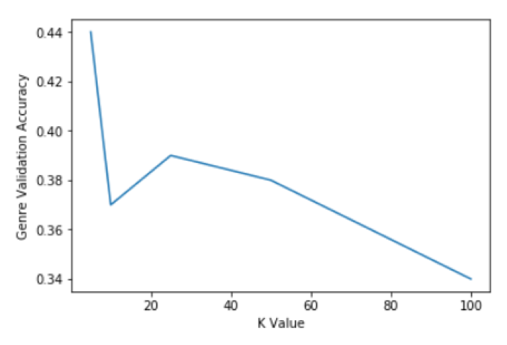

# Models

## Singular Value Decomposition (SVD) Matrix Factorization

We began by constructing a number of difference collaborative filtering models. Specifically, we first utilized singular value decomposition (SVD) matrix factorization, which reduces the dimensionality of our data and creates a first matrix of dimension k x u and a second matrix of dimension i x k, where u is the number of users, or in this case playlists, and i is the number of items, or in this case songs. Based on k as a hyperparameter, the SVD algorithm utilizes gradient descent to find the matrix of the specified dimensions which best approximates the training set. In doing so, it makes approximations that are used to identify latent factors in user’s preferences, which can help suggest new songs that a user might actually like to include in their playlist.

Based on genre-based validation using a random subset of songs, the optimal value of k appeared to be 5, achieving a validation accuracy of 0.44. Note that given computational complexity, we chose relatively small validation sets, in this case a random sample equal to 5% of the total playlists. In addition, we also performed qualitative validation by looking at particularly distinctive playlists to best measure if the tool was successfully identifying songs based on intuition. For example, we found the following robust results based on a playlist of Spanish-language songs and a playlist of Christmas songs:

_yay_

[back](./)
