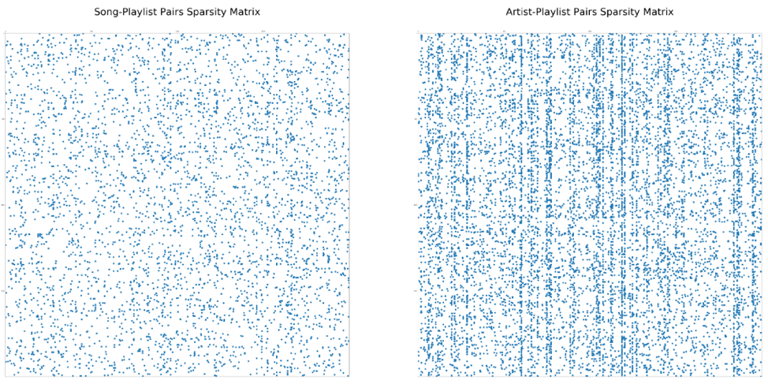
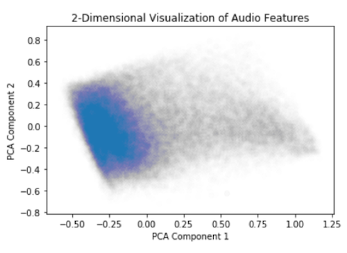
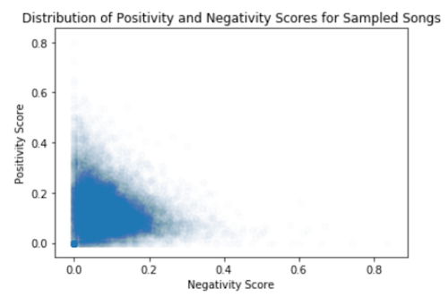

# EDA and Background

Links to CSVs:
[Artist Genres](https://drive.google.com/file/d/1ueUMpPDVFPS7Er8Mq9-IqRHMJ2avSqCG/view) |
[Track Features](https://drive.google.com/file/d/1OiJ7NGIXmrWXXBNaYoIrPgkMOI2wEDfw/view) |
[Tracks/Lyrics](https://drive.google.com/file/d/1l0rTqWhIfQw4Hv8KRySvL6A6mkE2PRIz/view) |
<!--<a href="https://drive.google.com/file/d/1ueUMpPDVFPS7Er8Mq9-IqRHMJ2avSqCG/view" class="btn">CSV (Artist Genres)</a>
<a href="https://drive.google.com/file/d/1OiJ7NGIXmrWXXBNaYoIrPgkMOI2wEDfw/view" class="btn">CSV (Track Features)</a>
<a href="https://drive.google.com/file/d/1l0rTqWhIfQw4Hv8KRySvL6A6mkE2PRIz/view" class="btn">CSV (Tracks/Lyrics)</a>
-->
## Data Processing
We began by loading in the playlist datasets and creating various functions to generate a matrix with a line for each song play including its playlist ID. Specifically, we took a sample of 2,000 playlists, representing over 57,000 unique songs. Based on the qualitative findings which we discuss in the Model section, this sample proved satisfactory for generating predictions using many of our selected methodologies. Note that throughout this website, we use the terms “playlist” and “user” interchangeably at times, as without data on how many playlists were created by the same user, the playlist ID takes the role of the user ID in other collaborative filtering contexts.

We next generated a matrix of p playlists by n songs, with a 1 indicating whether that song is present in a playlist. This format was useful for our later collaborative filtering recommendation system model building. The dataset does not have information on which playlists were created by the same users, so we have treated each playlist as equivalent to a user in the traditional parlance of collaborative filtering. This data allowed us to make well-performing models without any knowledge of the underlying content of the songs.

To build upon the existing dataset, we also leveraged the “Spotipy” Python library, a thin client library supporting the features of the Spotify API. This library allows us to submit requests to identify relevant information including song and artist features, and number of plays. We used the library to access genre (discussed under Genre Validation Data), as well as metadata in the form of audio features, which we then went on to use for constructing a content-based recommendation system. Interestingly, the models built as content recommenders tended to underperform in terms of genre validation compared to the models built using strictly collaborative filtering approaches. We discuss these points further under the Model section.

On a technical note, our current dataset allowed for us to search using both song IDs and song titles. Because many songs could conceivably have the same titles, we relied on the unique song IDs for our database queries in the final project, and then matched the results of our predictor functions with the actual song titles for generating a recommendation output.

## Noteworthy Findings on Song-Playlist Data Structure
Our primary takeaway from our exploratory data analysis was the issue of sparsity in the data. When we began building models, most traditional classification approaches were not able to underperform the trivial strategy of always guessing a song will not be included in a given playlist. When the chances of a song being included in a given playlist are well below 1%, that is not an entirely surprising result.

  
*Figure 1*

As a result, the most successful model we built using traditional classification methodologies was a neural network where we made artist recommendations based on the existing artists included in a given playlist. As shown in *Figure 1*, considering artist-playlist pairs rather than song-playlist pairs significantly mitigates against the issue of sparsity in the dataset.

  
*Figure 2*

We were also focused on understanding the breakdown of playlist length in order to understand to what extent we would be addressing the “cold-start” problem in our dataset. The data was rather mixed, with some playlists in the range of over 250 songs, and the vast majority in the range of 25-50 songs. The density of song length per playlist is shown in *Figure 2*.

## Audio Feature Data
As mentioned above, we utilized a content-based recommender system based on metadata on audio features provided through Spotify’s API. Specifically, the features included acousticness, danceability, energy, liveness, loudness, speechiness, tempo, and valence. A 2-dimensional visualization of these features based on Principal Components Analysis (PCA) is provided for reference in *Figure 3*. Note that there is not the immediate appearance of multiple well-defined clusters, which may have partially explained why our content-based model approaches underperformed compared to collaborative filtering.

  
*Figure 3*

## Genre Validation Data
We spent considerable time discussing an appropriate validation strategy, given that our goal for a recommender system is not purely predictive. The sparsity of the data makes it highly unlikely that we would be able to successfully predict whether a given playlist includes a certain song. In fact, our goal is perhaps best defined as identifying the songs that would have been included in a playlist if the user were aware of them. Based on the data available, we cannot ascertain that a user does not like a certain song merely because it wasn’t included in the playlist.

To this end, we felt validation based on artist genre, which we pulled through the Spotify API, was an appropriate mechanism to determine whether a recommender model is successfully identifying songs that would match a user’s preferences in a given playlist. Our goal was not necessarily to target very high validation success, as we do want to introduce some novelty into the potential playlist suggestions. In addition, it’s worth noting the relative sparsity of the genre data as well, as a large number of artists’ genres are not identified. The genre data is also highly specific, with a number of highly nuanced categories that might indicate a negative classification result when we perform validation, even if the two songs do fall under a broader genre (e.g. “acid jazz” and “nu jazz” are two separate categories for classification purposes). Many artists have more than one of these specific related genre included, so for simplification purposes, we included only the first genre listed.

## NLP Data
To add further complexity to our models, we analyzed the lyrics of the songs. First, we called the lyrics of each song using lyricwikia, and removed songs for which we could not find lyrics. There were quite a few songs that this removed, such as instrumental, electronic and trance, and foreign language songs, but the purpose of this exercise was to look at features of the songs unveiled by the “sentiment” of the lyrics. To examine the sentiment, we used the Sentiment Intensity Analyzer from the Natural Language Toolkit (NLTK) Python package. This package allows us to take a set of strings (say, a sentence or a paragraph) and find the ‘polarity score’, or how much the strings skew towards a negative or positive sentiment. It does this by comparing the words in the string to a list of words that convey positive, negative, or neutral feelings. It is also smart enough to know the opposite meanings of “great” and “not great”, as a simple example. It also gives us an overall ‘compound’ score, which gives on a -1 (very negative) to +1 (very positive) scale the overall sentiment. To use this toolkit, we had to first ‘tokenize’ it using NLTK, or break down the lyrics into analyzable parts such as verses or paragraphs. We then run each of these subparts through the sentiment analyzer to get the scores for negativity, neutrality, positivity, and overall compound score. To get an overall score for each of these 4 metrics for the whole song, we weighted each score by the number of words that tokenized subpart made up out of all the words in the song. This method provides us a way to convert the lyrics into numerical features that can then be modeled. The distribution of positivity and negativity scores is visualized in *Figure 4*.

  
*Figure 4*

[Introduction](./index.md) | EDA | [Models](./models.html) | [Conclusions and References](./conclusions.html)
