# Models

## Singular Value Decomposition (SVD) Matrix Factorization

We began by constructing a number of difference collaborative filtering models. Specifically, we first utilized singular value decomposition (SVD) matrix factorization, which reduces the dimensionality of our data and creates a first matrix of dimension k x u and a second matrix of dimension i x k, where u is the number of users, or in this case playlists, and i is the number of items, or in this case songs. Based on k as a hyperparameter, the SVD algorithm utilizes gradient descent to find the matrix of the specified dimensions which best approximates the training set. In doing so, it makes approximations that are used to identify latent factors in user’s preferences, which can help suggest new songs that a user might actually like to include in their playlist.

Based on genre-based validation using a random subset of songs, the optimal value of k appeared to be 5, achieving a validation accuracy of 0.44. Note that given computational complexity, we chose relatively small validation sets, in this case a random sample equal to 5% of the total playlists. In addition, we also performed qualitative validation by looking at particularly distinctive playlists to best measure if the tool was successfully identifying songs based on intuition. For example, we found the following robust results based on a playlist of Spanish-language songs and a playlist of Christmas songs:

**Christmas Songs**

| Previous Songs        | Recommended Songs |
|:-------------|:------------------|
| All I Want for Christmas Is You, Santa Baby, Have Yourself A Merry Little Christmas - 1999, Last Christmas, I've Got My Love To Keep Me Warm, White Christmas, It's Beginning to Look a Lot Like Christmas, Winter Wonderland, The Christmas Song (Merry Christmas To You), Little Saint Nick | All I Want for Christmas Is You, It's Beginning To Look A Lot Like Christmas, Holly Jolly Christmas, Have Yourself A Merry Little Christmas, Jingle Bells (feat. The Puppini Sisters), Christmas (Baby Please Come Home), Santa Baby, White Christmas (Duet With Shania Twain), I'll Be Home For Christmas, All I Want For Christmas Is You |
|  |  |

**Spanish-Language Songs**

| Previous Songs        | Recommended Songs |
|:-------------|:------------------|
| Bella y Sensual, Cuatro Babys, Quiero Repetir, Mera Bebe, En La Intimidad, Vuelva, Snapchat, Felices los 4, Corazon de Seda (feat. Ozuna), Recuerdos | Fanática Sensual, El Perdón, Ginza, 6 AM, Borro Cassette, Dile Que Tu Me Quieres, Bailando - Spanish Version, Yo Te Lo Dije, La Gozadera |
|  |  |

## Pearson Correlation (Song-Song and Playlist-Playlist)

In addition to implementing the widely used SVD matrix factorisation technique, we also used a basic Pearson coefficient pairwise correlation approach, which does not attempt to identify any latent factors in the data but simply offers recommendations based on correlation with other songs. Note that we are not referring to the actual content of the songs, as this is a pure collaborative filtering technique. Rather, we are referring to the similarity of other songs based on which playlists they mutually appear in. More broadly in the literature, this type of methodology is referred to as memory-based item-item collaborative filtering. In terms of prediction, our function takes a random sample of songs from a given playlist, finds similar songs, and then identifies the most similar ones.

In addition, we also implemented a user-user, or playlist-playlist, based approach. Here, similar playlists are identified based on which songs they mutually included and excluded. Specifically, our prediction function first finds the playlist most similar to the input playlist, and then makes a set of random song recommendations from that playlist.

The Pearson coefficient methodology was generally effective based on genre validation, achieving a similar level of approximately 0.4 based on our small random validation set. (Again, given computational complexity, it was infeasible to test on a large set). The playlist-playlist function performed slightly higher with a genre validation accuracy of 0.43, while the song-song function achieved a validation accuracy of 0.40.

A qualitative example demonstrating the capabilities of each recommender is included below for reference:

**Song-Song**

| Previous Songs        | Recommended Songs |
|:-------------|:------------------|
| Down, Hard to Handle, Broadway, Two Princes, Hooch, Slide, All Over You, Good, Rooster | Hey Man Nice Shot, You’re the World to Me, Morning Light, On the Way Home, Cherry Bomb, Fairlane (Live), You and I Both - Eagles Ballroom Live Version, Celebrate Good Times (Come On), Easy, Broadway |
| 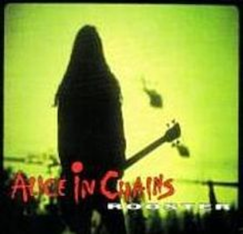 |  |

**Playlist-Playlist**

| Previous Songs        | Recommended Songs |
|:-------------|:------------------|
| The House That Built Me, John Cougar John Deere John 3:16, Only Prettier, Springsteen, White Liar, Staring at the Sun, Fast Cars and Freedom, Sippin’ On Fire, Laughed Until We Cried, Feels Like Today | Dirt Road, Dirt, 5-1-5-0, Boondocks, We Danced, Remind Me - Duet with Brad Paisley, Baby Be My Love Song, Don’t You Wanna Stay, Somethin’ Bout a Truck, I Got a Car |
|  | 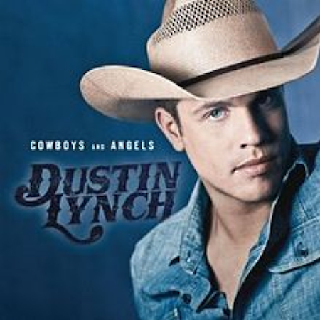 |

## K Nearest Neighbors Cosine Distance (Song-Song and Playlist-Playlist)

Subsequently, we implemented a kNN algorithm as well, a similar type of distance-based algorithm, using cosine distance. We utilized cosine distance between different inputs based on precedent in the literature. Again, an item-item recommendation approach was utilized initially, finding the nearest neighbors to a given song based on how many of the same playlists they both appeared in. Subsequently, we expanded to a playlist-playlist based approach, finding similarities between given playlists based on which songs they both included, and then recommending songs from the similar playlists.

**Song-Song**

| Previous Songs        | Recommended Songs |
|:-------------|:------------------|
| Jasmine Runs Away, Magic Carpet/Parting The Seas, Who Better Than Me - Broadway Cast Recording, The Gospel Truth II, Beyond My Wildest Dreams - Broadway Cast Recording, The Ends of the Earth, If Only (Quarter) - Broadway Cast Recording, Main Title - The Little Mermaid, Aladdin and Cassim Escape, I Want the Good Times Back | Beauty And The Beast (Reprise), Overture, One Jump Ahead (Reprise)|
| 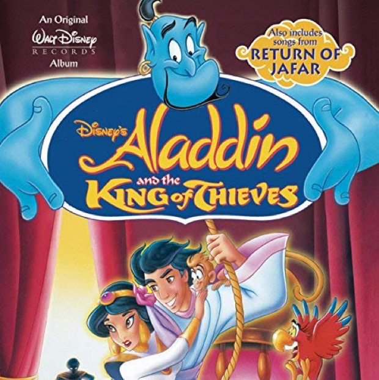 |  |

**Playlist-Playlist**

| Previous Songs        | Recommended Songs |
|:-------------|:------------------|
| Lookin Boy - Main Version, Do Ya Head Like This, Scenario - LP Mix, It’s Goin’ Down (feat. Nitti), Beautiful Girls, Sexy Can I feat. Yung Berg, Look At Me Now, SexyBack, Soul Survivor, Gin and Juice | Gold Digger, Ignition - Remix, Buy U a Drank (Shawty Snappin’), It Wasn’t Me, Tipsy - Club Mix, Yeah!, Kiss Me Thru The Phone, Get Low - Street, In Da Club, Hot In Herre |
|  |  |

## Neural Networks (Song-Song and Playlist-Playlist)

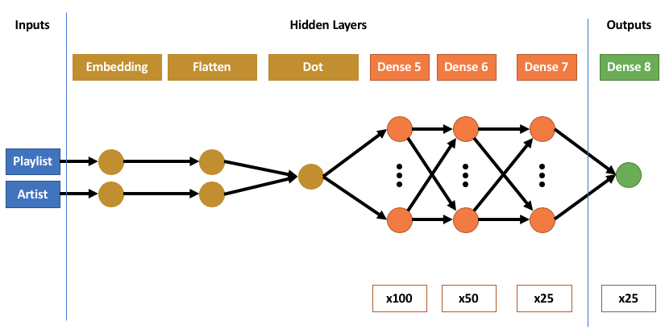

As a last collaborative filtering model, we attempted to implement a neural- network-based approach. The size of the possible playlist-song combinations made training a neural network on the full dataset computationally infeasible. In addition, when we trained on a relatively large subset of songs, even after experimenting with various network architectures, all of which included an embedding layer to identify latent factors, the model typically converged on a constant prediction of 0, namely always assuming that a user would not listen to a song. This makes sense given the relative sparsity of the matrix, as instances when a user does not listen to a song are much more common than vice versa. The relative sparsity of item-user pairs is shown below (blue points represent song-playlist combinations where the song was included in a given playlist) for a random 2,000-song sample from the total dataset.

Specifically, the architecture we employed began with an embedding layer (similar to matrix factorization) for both the song inputs and playlist inputs. The dot product of these two inputs is then taken, after which we employ a standard artificial neural net architecture, with three hidden layers (100 nodes, 50 nodes, and then 25 nodes), followed by a final activation layer with a single output. We utilized Adam for optimization, which we found to produce the best results and most quickly converge, which is an important concern given the large size of our dataset, even after sampling for only 2,000 playlists. For embedding, we utilized 15 latent factors for both songs and users.

To combat this issue, we first attempted to train the network on a filtered subset of songs with a positive bias, specifically including only songs that occurred in over 30 playlists. Interestingly, we found the model to produce the best results with a linear activation function (the hidden layers used a sigmoid function), which did not make intuitive sense to us given we considered the task to be a classification problem. Nonetheless, we tested our various neural net implementations with a variety of activation functions, and none performed as well as the linear function. We speculate this may be related to the sparsity of the data.

However, even with these modifications, the first neural-net only produced a genre validation accuracy of 0.14. In many cases, the neural net would not make any recommendations, as we only suggest a song to the user if the model outputs a “1” when the playlist-song pair previously had exhibited a “0” (i.e. the song was not played).

We proceeded to experiment with an artist-playlist neural net, which as discussed in the EDA significantly mitigates against sparsity. We employed the same structure (shown in Figure 5) of embedding layers followed by dot product and then three hidden layers. However, in this case, the inputs which were embedded were the artists and playlists.

The results significantly improved by analyzing artists. In this case our predictor function recommends a series of artists based on which artists are included in a given playlist. Based on the artists’ genre, the validation score achieved was 0.37. Example recommendations are shown below.

**Playlist-Song**

| Previous Songs (sample)        | Recommended Songs |
|:-------------|:------------------|
| Planez, Money Longer, That’s What I Like, Rollin, Location, Wild Thoughts, Magnolia, Drowning (feat. Kodak Black) | DNA, Bad and Boujee, Rockstar, Mask Off, T-Shirt, Passionfruit, iSpy (feat. Lil Yachty)|
|  |  |

**Playlist-Artist**

| Previous Songs (sample)        | Recommended Songs |
|:-------------|:------------------|
| Jake Owen, Dierks Bentley, Blake Shelton, George Strait, Little Big Town, Chris Young | Dustin Lynch, Cole Swindell, Jon Pardi, Chris Stapleton, Eli Young Band, Craig Morgan, Dan + Shay |
| 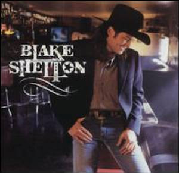 | 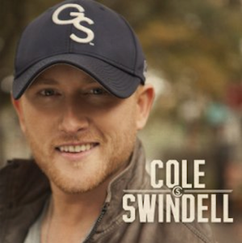 |

## Content-Based Pearson Correlation
We next moved into constructing a series of models based on audio feature metadata accessed via Spotify’s API. Specifically, we developed a model to make recommendations based on acousticness, danceability, energy, liveliness, loudness, speechiness, tempo and valence. As one might perhaps expect, the recommendations did not fully conform to the genre of the existing songs in a playlist, and so it was difficult to qualitatively validate whether the model was performing as expected. In order to ensure our model was performing as intended, we plotted the kernel densities of the distribution of existing/predicted songs compared to the distribution of all songs in the dataset, showing clearly distinct distributions compared to the overall population of songs ([Figure 6]). In terms of genre-based validation, the model performed poorly, with a score of only 0.2.

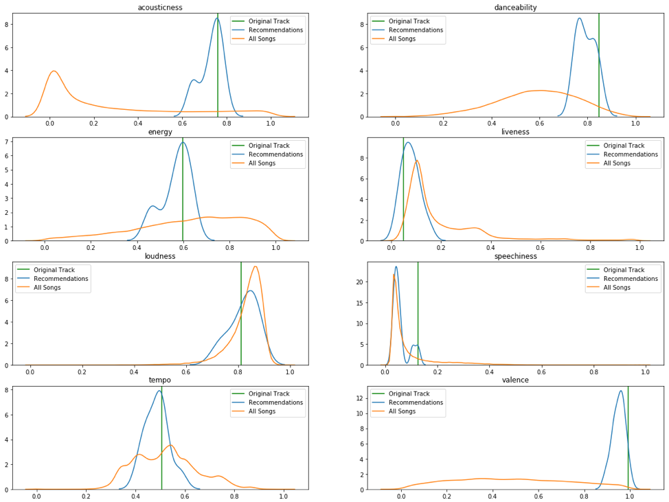

| Previous Songs (sample)        | Recommended Songs |
|:-------------|:------------------|
| Juke Box Hero, Holiday/Boulevard of Broken Dreams, Girlfriend (German Version), I Don’t Want to Miss a Thing, How You Remind Me, Bad Day, Slide, Hanging By a Moment, Rape Me, Chasing Cars | Can’t Stop, Big Yellow Taxi, First Date, Paris (Ooh La La), Hey Baby, I’m Going Free (Jailbreak), Say I’m Wrong, Ride, One World feat. Siti Monroe, Beautiful Day |
| 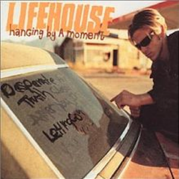 |  |

## Content-Based Classification Tree with Boosting
We next explored a classification tree structure for classifying data based on content. Specifically, for every playlist, we calculated the average value for each metadata feature across the playlist. We then calculated the differences for each song relative to the playlist data. The distribution of playlist averages and song-specific values are shown in [Figure 7], for the most part indicating the centering effect we would expect for the playlist averages. The theory behind our model was that a song whose features are closer to the playlist averages would be more likely to be included in a given playlist.

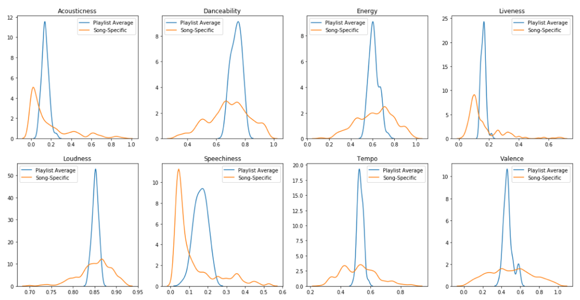

Based on this data, we trained a classification tree to predict if a song would be included in a given playlist given the feature distance from the average. Any songs which had not previously been included but for which the tree predicted a positive binary value of 1 would then be suggested for inclusion. We utilized a boosting approach implemented through AdaBoost with 250 predictors.

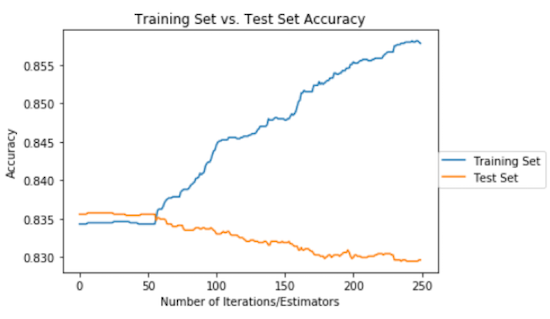

Overall, this model performed poorly. By plotting a training set and test set performance ([Figure 8]), we were able to see that until a threshold number of predictors, the model simply classified based on the trivial approach of always assuming a song would not be played. When boosting did finally cause the predictor to begin suggesting songs, it only constituted overfitting, as test set performance began declining immediately. The model did score 0.5 on the genre validation test, a strong result, but this is likely due to significant overfitting. In addition, similarly to how we addressed the underperforming song-playlist neural net, we filtered the data here to only include songs which were played over 30 times, helping to mitigate the sparsity issue.

| Previous Songs (sample)        | Recommended Songs |
|:-------------|:------------------|
| No Hands, That’s What I Like, Mask Off, Rolex, No Problem, 2 Phones | Say It, Trap Queen |
|  |  |

## Lyrics Text-Based Pearson Correlation
We next expanded upon our analysis by incorporating the results of our NLP data into our existing content-based distance model. We built upon the existing audio metadata and added an additional feature for the Compound metrics, which captures the positivity, negativity, and neutrality of the lyrics of a given song. Of the entire sample, we were able to successfully pull lyrics for approximately 18,000 songs, which defined the subset for this model.

The addition of the compound feature did not appear to improve the results when making recommendations based on the Pearson correlation coefficient. During cross-validation, the model achieved a score of only 0.06. Again, because of computational time for calculating distances, it was necessary to utilize a small sample size for cross-validation. Sample qualitative recommendation results are provided.

| Previous Songs        | Recommended Songs |
|:-------------|:------------------|
| Rather Be (feat. Jess Glynne), Summer, Uptown Funk, All About That Bass, Pompeii, Despacito (feat. Daddy Yankee), Wild Thoughts, Sugar (feat. Francesco Yates), Ain’t Nobody (Loves Me Better), Roses | Silvia, Watermelon Crawl, If You Leave, Cannibal, Dirt Road Anthem (feat. Brantley Gilbert), The Power of Love, Caribbean Queen (No More Love on the Run), We Supposed To Be, Walk On Water, U Da Realest |
|  |  |

## Model Comparison

Overall, based on qualitative analysis of the playlist and performance using cross-validation, we found that the collaborative filtering techniques tended to outperform the content-based recommenders. In addition, those models based on similarities between users without a traditional classification training set tended to show greater robustness. We would consider the various distance-based approaches (Pearson coefficient correlation) and kNN with cosine distance, as well as SVD-based matrix factorization, to show the greatest potential for further exploration. This conclusion is also supported based on the strong qualitative results produced by these models which we have displayed throughout this section. Results are summarized in [Figure 9].

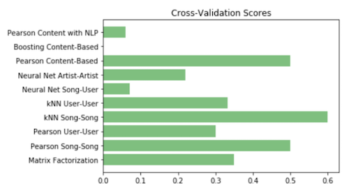

_yay_

[back](./)
